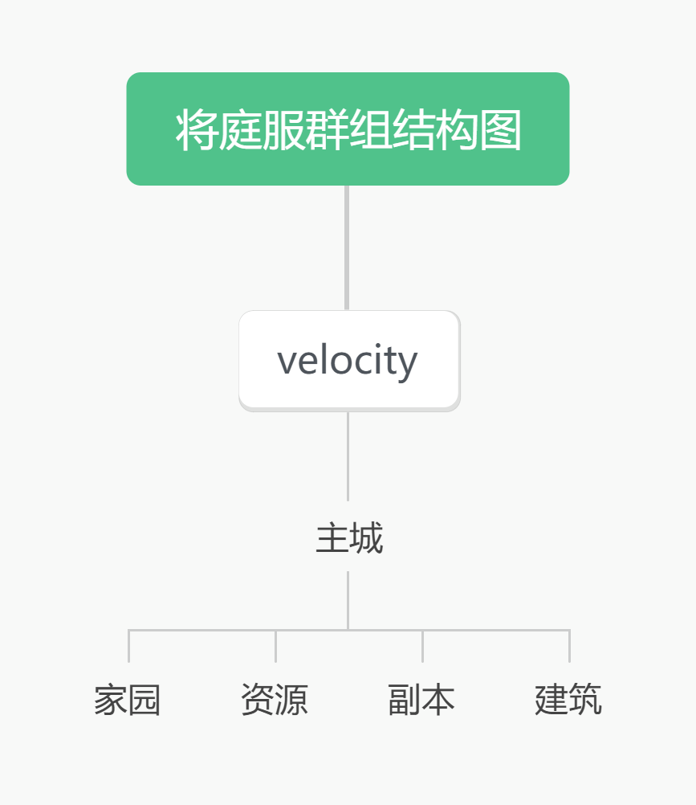

## 服务器架构

将庭服采用群组服架构，使用 velocity 作为代理端：

velocity 文档：https://docs.papermc.io/velocity

主城：lobby

家园：home

资源：resource

副本：dungeon

建筑：creative



#### （一）Velocity 配置

`velocity.toml`

> [!NOTE]
>
> ##### 无论 `Velocity` 是否开启 `online-mode`，所有子端都要关闭 `online-mode`
>
> ##### 因为 `Velocity` 已对玩家进行了身份验证，子端不需要重复验证
>
> 若 `Velocity` 开，子端开；则控制台报： Backend server is online-mode!
>
> 若 `Velocity` 开，子端关；则仅限正版玩家进服
>
> 若 `Velocity` 关，子端开；则控制台报： Backend server is online-mode!
>
> 若 `Velocity` 关，子端关；则正版和离线玩家均可进服

```toml
# 配置版本，不要更改
config-version = "2.7"

# 代理应该绑定到哪个端口？默认情况下，将绑定到所有地址的 25565 端口。
bind = "0.0.0.0:25565"

# Velocity 的 motd，会覆盖下游的 motd，只接受 MiniMessage 格式。
# 该项由 Minimotd 插件接管。
motd = "<#09add3>A Velocity Server"

# 展示的最大玩家数是多少？（不支持更改在线玩家数量，只是显示）。
show-max-players = 50

# 是否开启正版验证？默认开启。无论 Velocity 是否开启或关闭验证，所有下游都必须关闭正版验证。
online-mode = true

# 代理是否应该执行新的公钥安全标准？默认情况下，这是开启的。
force-key-authentication = true

# 如果客户端从这个代理发送的 ISP/AS 与 Mojang 的认证服务器不同，玩家将被踢出。
# 这禁止了一些 VPN 和代理连接，但这是一种较弱的保护形式。
prevent-client-proxy-connections = false

# 我们应该将 IP 地址和其他数据转发到后端服务器吗？
# 可用选项：
# - "none":        所有玩家的 UUID 表示为离线，包括正版玩家，并且不会进行转发。
# - "legacy":      以 BungeeCord 兼容的格式转发玩家 IP 和 UUID。如果您运行的是Minecraft 1.12 或更低版本，请使用此选项。
# - "bungeeguard": 以 BungeeGuard 插件支持的格式转发玩家 IP 和 UUID。如果您运行的是Minecraft 1.12 或更低版本，并且无法实现网络级防火墙（在共享主机上），请使用此选项。
# - "modern":      使用 Velocity 的原生转发作为登录过程的一部分转发玩家 IP 和 UUID。仅适用于 Minecraft 1.13 或更高版本。
player-info-forwarding-mode = "modern"

# 如果您使用现代或 BungeeGuard IP 转发，请在此处配置包含唯一密钥的文件。
# 文件预期为 UTF-8 编码且不为空。
forwarding-secret-file = "forwarding.secret"

# 宣布您的服务器是否支持 Forge。如果您运行的是带有 mod 的服务器，我们建议开启此选项。
# 如果您的网络始终运行一个 mod 包，考虑使用 ping-passthrough = "mods" 以在服务器列表中获得更好的展示。
announce-forge = false

# 如果启用（默认为 false）并且代理处于在线模式，
# 当一个人多次连接满人服时，Velocity 将随机踢出一个在线玩家以腾位。
kick-existing-players = false

# Velocity 是否应该将服务器列表 ping 请求传递给后端服务器？
# 可用选项：
# - "disabled":    不会进行传递。velocity.toml 和 server-icon.png 将决定初始服务器列表 ping 响应。
# - "mods":        仅从您的后端服务器传递 mod 列表到响应中。将使用尝试列表中的第一个服务器（或强制主机）的 mod 列表。如果无法联系到后端服务器，Velocity 不会显示任何 mod 信息。
# - "description": 使用后端服务器的描述和 mod 列表。尝试列表中第一个响应的服务器（或强制主机）将用于描述和 mod 列表。
# - "all":         使用后端服务器的响应作为代理响应。如果无法联系到服务器，将使用Velocity 配置。
ping-passthrough = "all"

# 如果未启用（默认为 true），玩家 IP 地址将在日志中被替换为 <ip address withheld>。
enable-player-address-logging = true

[servers]
# 在此处配置您的服务器。每个键代表服务器的名称，值代表要连接的服务器的 IP 地址。
# 英文名不需要加 ""，中文名需要加 ""。
lobby = "127.0.0.1:25501"
home = "127.0.0.1:25502"
resource = "127.0.0.1:25503"
dungeon = "127.0.0.1:25504"
creative = "127.0.0.1:25505"

# 当玩家登录或从服务器被踢出时，我们应该以什么顺序尝试服务器。
try = [
    "lobby"
]

[forced-hosts]
# 在此处配置您的强制主机。
"lobby.example.com" = [
    "lobby"
]
"home.example.com" = [
    "home"
]
"resource.example.com" = [
    "resource"
]
"dungeon.example.com" = [
    "dungeon"
]
"creative.example.com" = [
    "creative"
]

[advanced]
# Minecraft 数据包需要多大，我们才会压缩它。将此设置为零将压缩所有数据包，设置为 -1 将完全禁用压缩。
compression-threshold = 256

# 应该进行多少压缩（从 0-9）。默认是 -1，使用默认级别 6。
compression-level = -1

# 客户端在最后一次连接后，允许多快（以毫秒为单位）连接。默认是三秒。将此设置为 0 以禁用此功能。
login-ratelimit = 3000

# 在此处指定连接超时的自定义超时时间。默认是五秒。
connection-timeout = 5000

# 在此处指定连接的读取超时时间。默认是 30 秒。
read-timeout = 30000

# 启用与 HAProxy 的 PROXY 协议的兼容性。如果您不知道这是用来做什么的，那么就不要启用它。
haproxy-protocol = false

# 启用代理上的 TCP 快速打开支持。需要代理在 Linux 上运行。
tcp-fast-open = false

# 启用 Velocity 上的 BungeeCord 插件消息通道支持。
bungee-plugin-message-channel = true

# 向客户端显示代理的 ping 请求。
show-ping-requests = false

# 默认情况下，Velocity 将尝试优雅地处理用户意外失去与服务器的连接而没有明确的断开消息的情况，通过尝试回退用户，除了读取超时的情况。BungeeCord 将断开用户连接。您可以禁用此设置以使用 BungeeCord 的行为。
failover-on-unexpected-server-disconnect = true

# 向 1.13+ 客户端声明代理命令。
announce-proxy-commands = true

# 启用命令日志记录。
log-command-executions = false

# 启用玩家连接日志记录，当连接到代理、切换服务器和从代理断开连接时。
log-player-connections = true

# 允许通过传输包（Minecraft 1.20.5）从其他主机传输的玩家被接收。
accepts-transfers = false

[query]
# 是否启用响应 GameSpy 4 查询响应。
enabled = false

# 如果查询已启用，查询协议应该监听哪个端口？
port = 25565

# 这是报告给查询服务的地图名称。
map = "Velocity"

# 是否默认显示插件在查询响应中。
show-plugins = false
```


#### （二）子端配置

`paper-global.yml`

```yaml
proxies:
  bungee-cord:
    online-mode: true
  proxy-protocol: false
  # 启用 Velocity 对接
  velocity:
    enabled: true
    # online-mode 要和在 velocity.toml 中的 online-mode 设置相同
    online-mode: true
    # 对接验证密钥，视具体情况修改，这里是示例
    # 将 forwarding.secret 中的密钥复制于此
    secret: ncn5DHIFezVb
```


##### 1.主城 lobby

`server.properties`

```properties
# 禁用下界
allow-nether=false
# 游戏难度
# 和平（Peaceful）
# 简单（Easy）
# 普通（Normal）
# 困难（Hard）
difficulty=peaceful
# 游戏模式
# 生存模式（Survival）
# 创造模式（Creative）
# 冒险模式（Adventure）
# 旁观模式（Spectator）
# 极限模式（Hardcore）
gamemode=adventure
# 最大游戏人数
max-players=50
# 是否开启正版验证
online-mode=false
# 是否开启 PVP
pvp=false
# 监听的端口
query.port=25501
# 对接 velocity 中的子端 IP 地址设置
# 如果 velocity 和子端在同一网络环境，则可以使用 127.0.0.1
server-ip=127.0.0.1
# 服务器的端口，也是玩家进服的端口
server-port=25501
```

`bukkit.yml`

```yaml
# 禁用末地
settings:
  allow-end: false
```


##### 2.家园 home

`server.properties`

```properties
# 游戏难度
# 和平（Peaceful）
# 简单（Easy）
# 普通（Normal）
# 困难（Hard）
difficulty=normal
# 最大游戏人数
max-players=50
# 是否开启正版验证
online-mode=false
# 监听的端口
query.port=25502
# 对接 velocity 中的子端 IP 地址设置
# 如果 velocity 和子端在同一网络环境，则可以使用 127.0.0.1
server-ip=127.0.0.1
# 服务器的端口，也是玩家进服的端口
server-port=25502
```

`bukkit.yml`

```yaml
# 禁用末地
settings:
  allow-end: false
```


##### 3.资源 resource

`server.properties`

```properties
# 游戏难度
# 和平（Peaceful）
# 简单（Easy）
# 普通（Normal）
# 困难（Hard）
difficulty=hard
# 最大游戏人数
max-players=50
# 是否开启正版验证
online-mode=false
# 监听的端口
query.port=25503
# 对接 velocity 中的子端 IP 地址设置
# 如果 velocity 和子端在同一网络环境，则可以使用 127.0.0.1
server-ip=127.0.0.1
# 服务器的端口，也是玩家进服的端口
server-port=25503
```


##### 4.副本 dungeon

`server.properties`

```properties
# 禁用下界
allow-nether=false
# 游戏难度
# 和平（Peaceful）
# 简单（Easy）
# 普通（Normal）
# 困难（Hard）
difficulty=hard
# 最大游戏人数
max-players=50
# 是否开启正版验证
online-mode=false
# 监听的端口
query.port=25504
# 对接 velocity 中的子端 IP 地址设置
# 如果 velocity 和子端在同一网络环境，则可以使用 127.0.0.1
server-ip=127.0.0.1
# 服务器的端口，也是玩家进服的端口
server-port=25504
```

`bukkit.yml`

```yaml
# 禁用末地
settings:
  allow-end: false
```


##### 5.建筑 creative

`server.properties`

```properties
# 禁用下界
allow-nether=false
# 游戏难度
# 和平（Peaceful）
# 简单（Easy）
# 普通（Normal）
# 困难（Hard）
difficulty=peaceful
# 强制游戏模式，玩家每次进服自动改为默认游戏模式
force-gamemode=true
# 游戏模式
# 生存模式（Survival）
# 创造模式（Creative）
# 冒险模式（Adventure）
# 旁观模式（Spectator）
# 极限模式（Hardcore）
gamemode=creative
# 最大游戏人数
max-players=50
# 是否开启正版验证
online-mode=false
# 是否开启 PVP
pvp=false
# 监听的端口
query.port=25505
# 对接 velocity 中的子端 IP 地址设置
# 如果 velocity 和子端在同一网络环境，则可以使用 127.0.0.1
server-ip=127.0.0.1
# 服务器的端口，也是玩家进服的端口
server-port=25505
```

`bukkit.yml`

```yaml
# 禁用末地
settings:
  allow-end: false
```


